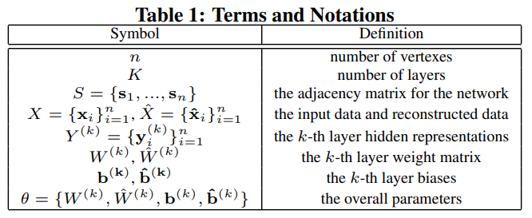

**Structural Deep Network Embedding (SDNE)** 于2016年发表在KDD，作者是清华大学的Daixin Wang1 , Peng Cui1 , Wenwu Zhu1。

**主要工作**：将自编码器应用在网络嵌入中，利用多层非线性函数组成的深度学习模型捕捉高度非线性的网络结构，将一阶相似性和二阶相似性联合加入训练过程，前者作为监督信息，捕捉网络的局部结构，后者作为无监督信息，捕捉网络的全局结构，从而整体是一个半监督深度模型。

# 1. 问题概述

## 1.1 网络嵌入的三个挑战

* **高度非线性**：网络的潜在结构高度非线性。
* **结构的保持**：网络潜在结构非常复杂，在嵌入空间中同时保持局部结构和全局结构。
* **稀疏性**：现实网络数据稀疏，只能利用有限的可见边。

## 1.2 解决方案

* **对于捕捉高度非线性的问题**，设计一个多层非线性函数组成的深度学习模型学习结点的表示，将数据映射到高度非线性的潜在空间，从而更好的捕捉网络的结构。
* **对结构保持和稀疏性问题**，将一阶和二阶相似性联合加入到训练过程，前者捕捉网络局部结构，后者捕捉网络全局结构。具有二阶相似性的结点对个数更多，因此在刻画网络结构上提供的信息越多，一定程度上缓解了稀疏性问题。

# 2. SDNE模型

## 2.1 符号含义

## 2.2 自编码器

**自编码器(Autoencoder)**：无监督学习模型，前半部分为编码器，将输入数据映射到表示空间；后半部分为解码器，将表示空间中的表示映射到重构空间。为了尽可能的重构输入数据，自编码器必须捕捉输入数据的重要特征。类似于传输文件中的压缩。给定输入$\mathrm{\boldsymbol{x}}_i$，每层的隐藏表示如下：
$$
\begin{aligned}
\mathrm{\boldsymbol{y}}_i^{(1)} &= \sigma(W^{(1)}\mathrm{\boldsymbol{x}}_i + \mathrm{\boldsymbol{b}}^{(1)}) \\
\mathrm{\boldsymbol{y}}_i^{(k)} &=  \sigma(W^{(k)}\mathrm{\boldsymbol{y}}_i^{(k-1)} + \mathrm{\boldsymbol{b}}^{(k)}),k=2,...,K
\end{aligned}
$$
得到$\mathrm{\boldsymbol{y}}_i^{(K)}$后，我们反转编码器的计算过程，得到输出$\hat{\mathrm{\boldsymbol{x}}}_i$，自编码器的目标就是最小化输入输出之间的重构误差：
$$
\mathcal{L}=\sum_{i=1}^n||\hat{\mathrm{\boldsymbol{x}}}_i-\mathrm{\boldsymbol{x}}_i||_2^2
$$

## 2.3 框架

输入是邻接矩阵$S$，即$\mathrm{\boldsymbol{x}}_i=\mathrm{\boldsymbol{s}}_i$，输出为重构后的邻接矩阵，中间结果$\mathrm{\boldsymbol{y}}_i^{(K)}$，就是Embedding向量。

模型的**无监督部分**是通过重构误差即重构结点之间的二阶相似性，来保持网络的全局结构。

模型的**监督部分**是通过拉普拉斯特征映射（Laplacian Eigenmaps）的思想，来使得有可见边连接的结点的Embedding向量接近，来保持网络的局部结构。（Why监督？对当前结点而言，label是邻居结点的embedding向量）

## 2.4 目标函数

总的目标函数$\mathcal{L}_{mix}$由目标函数和正则项$\mathcal{L}_{reg}$构成，目标函数中又分两部分，一阶相似性目标函数$\mathcal{L}_{1st}$，二阶相似性目标函数$\mathcal{L}_{2nd}$.

* $\mathcal{L}_{2nd}$
    $$
    \begin{aligned}
    \mathcal{L}_{2nd}&= \sum_{i=1}^n||\hat{\mathrm{\boldsymbol{x}}}_i-\mathrm{\boldsymbol{x}}_i \odot \mathrm{\boldsymbol{b}}_i||_2^2  \\
    &= ||(\hat{X}-X)\odot B||_F^2
    \end{aligned}
    $$
    $\mathrm{\boldsymbol{x}}_i=\mathrm{\boldsymbol{s}}_i$，$\mathrm{\boldsymbol{s}}_i$描述了结点$v_i$的邻居结构，重构过程能使得具有相似邻居结构的结点有着相似的潜在表示。由于网络的稀疏性，$\mathrm{\boldsymbol{s}}_i$有大量的0元素，直接将其作为输入自编码器更倾向将重构$S$的0元素，因此对非0元素的重构加大惩罚权重，$\mathrm{\boldsymbol{b}}_i=\{b_{ij}\}_{j=1}^n$，如果$s_{i,j}=0,b_{i,j}=1$，否则$b_{i,j}=\beta>1$.

* $\mathcal{L}_{1st}$
    $$
    \begin{aligned}
    \mathcal{L}_{1st}&=
    \sum_{i,j=1}^n s_{ij}
    ||\mathrm{\boldsymbol{y}}_i^{(K)}-\mathrm{\boldsymbol{y}}_j^{(K)}||_2^2  \\
    &= 
    ||\mathrm{\boldsymbol{y}}_i-\mathrm{\boldsymbol{y}}_j||_2^2 \\
    &= 2tr(Y^TLY)
    \end{aligned}
    $$
    将$Y^{(K)}=\{\mathrm{\boldsymbol{y}}_i^{(K)}\}_{i=1}^n$用$Y=\{\mathrm{\boldsymbol{y}}_i\}_{i=1}^n$，来代替.

总的目标函数
$$
\begin{aligned}
\mathcal{L}_{mix}&=\mathcal{L}_{2nd}+\alpha\mathcal{L}_{1st}+\nu \mathcal{L}_{reg} \\
&= ||(\hat{X}-X)\odot B||_F^2 + 2\alpha tr(Y^TLY) + \nu \mathcal{L}_{reg}
\end{aligned}
$$
$\alpha,\mu$是超参数，$\mathcal{L}_{reg}$是L2正则项，防止过拟合，定义如下：
$$
\mathcal{L}_{reg}=\frac{1}{2} \sum_{k=1}^K(||W^{(k)}||_F^2+||\hat{W}^{(k)}||_F^2)
$$

# 参考

[【Embedding】SDNE：深度学习在图嵌入领域的应用 - 云+社区 - 腾讯云 (tencent.com)](https://cloud.tencent.com/developer/article/1665501)

[论文笔记: Structural Deep Network Embedding | Dolantin (dolantinlist.github.io)](https://dolantinlist.github.io/2018/04/22/论文笔记-Structural-Deep-Network-Embedding/)

