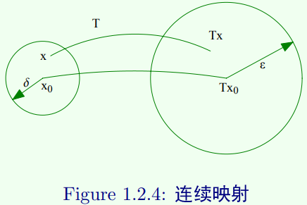

# 连续映射

$(X,d),(X_1,d_1)$是距离空间，$T:X\rightarrow X_1$是一个映射，$x_0\in X$，如果对任意给定的$\epsilon>0$，存在$\delta>0$，当$d(x_0,x)<\delta$时，有
$$
d_1(T(x_0), T(x_1)) < \epsilon
$$
则称$T$在$x_0$处连续.

邻域的语言：对任意给定$\epsilon > 0$，存在$\delta > 0$，使得$T(B(x_0,\delta)) \subset B(T(x_0),\epsilon)$

若$T$在$X$中每一点都连续，则称$T$在$X$上连续，称$T$是一个连续映射.

**定理1** $(X,d),(X_1,d_1)$是距离空间，$T:X\rightarrow X_1$是一个映射，$T$是连续的当且仅当$(X_1,d)$中的任何开集的原像仍是$(X,d)$中的开集.

**定理2** $(X,d),(X_1,d_1)$是距离空间，$T:X\rightarrow X_1$是一个映射，$T$在$x_0$连续当且仅当对每个满足$x_n\rightarrow x_0(n\rightarrow \infty)$的点列都有
$$
T(x_n)\rightarrow T(x_0),n\rightarrow \infty
$$
$T$连续，极限和$T$可交换顺序.

# 等距映射

$(X,d),(X_1,d_1)$是距离空间，$T:X\rightarrow X_1$是一个映射，若
$$
d(x,y)=d_1(T(x),T(y)),\forall x,y \in X
$$
则称$T$是等距映射（isometry）.

* **等距映射是连续映射**，但不一定是个满射.
* 若$T$是一个满的等距映射，即$T(X)=X_1$，则称$X$和$X_1$等距
* 等距的两个空间，在等距意义下可认为是同一空间.

例子：

通过$S:l^2\rightarrow l^2$ by$S(\alpha_1,\alpha_2,...)=(0,\alpha_1,\alpha_2,...)$，则$S$是一个等距映射，但不是满射.

# 保范映射

$(X ,||·||),(X_1,||·||_1)$是赋范线性空间，$T:X\rightarrow X_1$是一个映射，若
$$
||x||=||Tx||_1,\forall x \in X
$$
则称$T$是一个保范映射.

* 由保范性质知，

$$
||x-y||=||T(x-y)||_1, \forall x,y \in X
$$

* 通过范数可以诱导出$X$中的距离，若$T$是一个等距映射，即
    $$
    ||x-y||=||Tx-Ty||_1,\forall x,y \in X
    $$
    并且$T$是线性映射，即
    $$
    T(x-y)=Tx-Ty
    $$
    于是
    $$
    ||x-y||=
    \begin{aligned}
    ||T(x-y)||_1
    \end{aligned}
    $$

则若$T$是线性映射，保范$\Leftrightarrow$等距

# Hilbert空间中的同构

$H$和$K$是Hilbert空间，$U:H\rightarrow K$是**线性满射**，若
$$
<Uh,Ug>=<h,g>, \forall h \in H,g\in K
$$
称$U$是一个同构映射，$H$和$K$是同构的。

* $U$是同构映射，由于其是满射，则$U^{-1}$存在，且$U^{-1}$也是同构映射.

* 如果$V:H\rightarrow K$是Hilbert空间上的线性映射，则$V$是等距映射当且仅当$<Vh,Vg>=<h,g>,\forall h \in H,g\in K$（保持内积）

* 则如果映射是同构映射，则其也是等距映射，等距映射将距离空间中的Cauchy列映射为Cauchy列，因此同构保持完备性
* 则如果一个内积空间与一个Hibert空间同构，则这个内积空间是完备的，也是一个Hibert空间

# 酉算子

如果$U:X\rightarrow X$是一个线性等距满射，则称$U$是酉算子. 自身到自身的映射

若$H$是Hilbert空间，则$U$是一个同构映射。